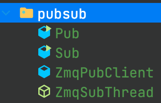

###
    简介：
    ZeroMQ简称ZMQ，它对socket编程进行了封装，通俗的说，它就像一个框架一样，对socket lib进行了很好的封装，让socket编程变得更加简单。
    ZMQ采用消息队列的方式对socket的包进行管理，它支持多线程，同时ZMQ是开源的，你可以在不同的Linux内核架构上缩减ZMQ模块，这在ARM嵌入式上非常有利。
    ZMQ的明确目标是“成为标准网络协议栈的一部分，之后进入Linux内核”，目前还未成功。
    ZMQ不是消息队列服务器，是一个基于消息队列模式的Socket库。

-------------------------------------------------------------------------------------------------------------------------------
    
    ZMQ的特点：
    socket是1：1，而ZMQ对socket封装了以后具有n：1的特点，所谓的n：1就是无数客户端可以同时连接一个服务器，你无需去做线程服务分发这样的工作，因为ZMQ都已经为你实现好了。
    同时socket的建立与通讯较为复杂，用户需要选择协议，端口，通讯类型、AF_INET、IPv4或者6等等，同时用户还需要考虑发送数据与接收数据的缓冲区大小，包括需要自己管理套接字，
    而ZMQ屏蔽了这些细节，让用户写少量的代码就能实现一个基本的服务器与客户端程序，同时它支持大文件传输，使得用户不用去关心很多细节，同时也降低了网络开发门槛，会让许多人可能都不太了解BSD的套接字协议。

-------------------------------------------------------------------------------------------------------------------------------
    
    ZMQ的三种模式：
    1.应答模式
    应答模式在ZMQ里是REQ和REP，服务端是REP、客户端是REQ
    典型的一问一答协议，即客户端需要首先发送hello，服务器则返回word，若客户端发送hello，服务器没有应答，后续通讯将不成立。

    如：
    客户端首先对服务端发送了hello，那么客户端会等待服务端应答，若在此期间客户端再次向服务端发
    送消息，服务端是收不到的，客户端有一个消息队列，会放入消息队列，只有在 客户端收到服务端的回应之后才会去依次处理消息队列里的内容。
    本案例中demo对订阅模式做了1个案例

    2.订阅模式
    即PUB/SUB，PUB代表服务器，SUB代表客户端
    这种服务即服务器会不停发送数据，然后客户端对其进行订阅，客户端会收到服务器发送的数据，且不需要做出应答，
    客户端也不需要发送打招呼消息，只需要连接上就会收到服务器的订阅消息。

    同时服务器不具有收客户端发送消息的能力。
    这是单向的，即服务器只能发，客户端只能收，可以同时多个客户端订阅一个服务器。
    本案例中demo对订阅模式使用了两个案例

    3.分布式模式
    即PUSH/PULL
    这种协议即服务器收到消息会立马推送给连接的客户端。
    如一个使用PUSH协议的服务器，然后有四个PULL客户端连接上去。
    如果我想同时发送消息给其它四个客户端，我不需要一个一个发，只需要给服务器发一个消息，服务器会自动推送给其它四个。
    本demo中没做演示

-------------------------------------------------------------------------------------------------------------------------------

    在使用ZeroMQ（也称为 ØMQ、0MQ、zmq）进行分布式或网络编程时，特别是在Java中实现发布/订阅（pub/sub）模式时，
    bind 和 connect 方法的使用取决于你的组件是扮演服务器（发布者）还是客户端（订阅者）的角色。

    基本概念
    bind: 这个方法用于让ZeroMQ的socket（套接字）监听一个端口，等待其他socket的连接。在发布/订阅模式中，发布者通常会使用bind方法，
    因为它需要提供一个稳定的端点，以便订阅者可以连接并接收消息。

    connect: 这个方法用于让ZeroMQ的socket连接到另一个已经通过bind方法启动并监听的socket。在发布/订阅模式中，
    订阅者会使用connect方法连接到发布者的端点。

    发布者
    使用ZMQ.PUB类型的socket：发布者创建一个ZMQ.PUB类型的socket，这是用于发布消息到所有订阅者的socket类型。
    使用bind方法：发布者通过调用bind方法将其socket绑定到一个端口（和可选的IP地址）上，等待订阅者的连接。
    发布消息：一旦socket绑定成功，发布者就可以通过该socket发送消息了。
    
    订阅者
    使用ZMQ.SUB类型的socket：订阅者创建一个ZMQ.SUB类型的socket，用于订阅发布者发布的消息。
    设置订阅过滤器（可选）：订阅者可以（但不是必须）设置订阅过滤器，以指定它感兴趣的消息类型。这里不赘述
    
    使用connect方法：订阅者通过调用connect方法连接到发布者的端点。
    接收消息：一旦连接成功，订阅者就可以通过其socket接收发布者发送的消息了。

###
